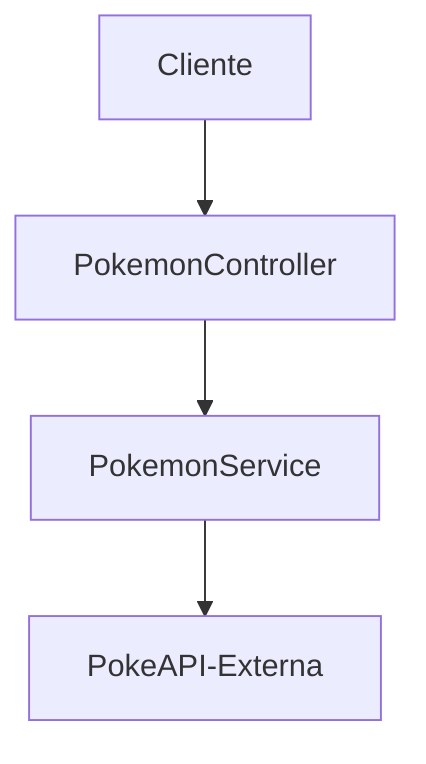

# 📝 Pokedex API (.NET)

API REST desenvolvida em **.NET 10** que consome a **PokeAPI** e fornece dados de Pokémon de forma organizada, filtrada e otimizada.

## ⚡ Tecnologias Utilizadas
* .NET 10
* ASP.NET Core Web API
* Swagger (OpenAPI)
* HttpClient
* Newtonsoft.Json

## 📁 Estrutura do Projeto

```text
PokedexApi/
│
├── 📂 Controllers/
│   └── 📄 PokemonController.cs
├── 📂 Services/
│   └── 📄 PokemonService.cs
├── 📂 Models/
│   └── 📄 PokemonResponse.cs
├── 📄 Program.cs
└── 📄 appsettings.json
```

## 🧠 Arquitetura



## 🌐 Integração Externa

Dados fornecidos por: https://pokeapi.co/

## 🔗 Endpoints e Rotas

| Ação | Rota | Descrição |
| :--- | :--- | :--- |
| BuscarNomes | `/pokemon/listOfNames` | Lista todos os pokémons desejados. |
| BuscarPorId | `/pokemon/id/{id}` | Filtra o pokémon com determinado Id. |
| BuscarPorNome | `/pokemon/name/{name}` | Filtra o pokémon pelo nome. |
| BuscarPorTipo | `/pokemon/typE/{type}` | Lista pokémons por determinado tipo. |


## 🛠️ Funcionalidades detalhadas
Abaixo um exemplo da interface Swagger com os endpoints disponíveis:


### 1. Busca por nome
* Permite realizar uma busca na PokeApi pelo nome do Pokémon.
  
#### Exemplo:

```http
GET /pokemon/name/pikachu
```

---

### 2. Busca por ID
* Permite uma pesquisa dentro da Api externa por meio do Id do Pokémon.

#### Exemplo:

```http
GET /pokemon/id/25
```

---

### 3. Busca por tipo
* Permite listar Pokémons de determinado tipo existente.

#### Exemplo:

```http
GET /pokemon/type/fire
```

---

### 4. Listagem com limite
* Permite fazer a listagem de todos os Pokémons limitando a quantidade que se deseja vizualizar.

#### Exemplo:

```http
GET /pokemon/listOfNames?limit=20
```


## 🧾 Modelo de Dados (DTO)

```csharp
public class PokemonResponse
{
    public int Id { get; set; }
    public string Name { get; set; }
    public string Image { get; set; }
    public int Height { get; set; }
    public List<string> Types { get; set; }
    public List<string> Abilities { get; set; }
}
```


## ⚙️ Como Executar

### 1. Clonar o repositório

```bash
git clone https://github.com/kenzofrias/pokedex-dotnet.git
```

---

### 2. Acessar pasta

```bash
cd pokedex-dotnet
```

---

### 3. Restaurar dependências

```bash
dotnet restore
```

---

### 4. Executar

```bash
dotnet run
```

---

### 5. Acessar Swagger

```text
http://localhost:xxxx/swagger
```

## 📌 Considerações
*Este projeto foi desenvolvido com foco em boas práticas de desenvolvimento backend utilizando .NET, incluindo: consumo de APIs externas, organização em camadas e construção de endpoints RESTful.
O principal objetivo é aprimorar conhecimentos para possíveis aplicações reais.*

---
<div align="center">
  
  **Obrigado pela visita!**  
  [Kenzo Friás](https://www.github.com/kenzofrias) © 2026
  
</div>

